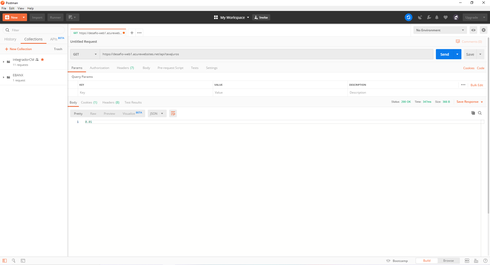
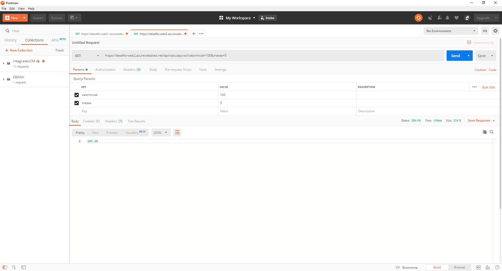
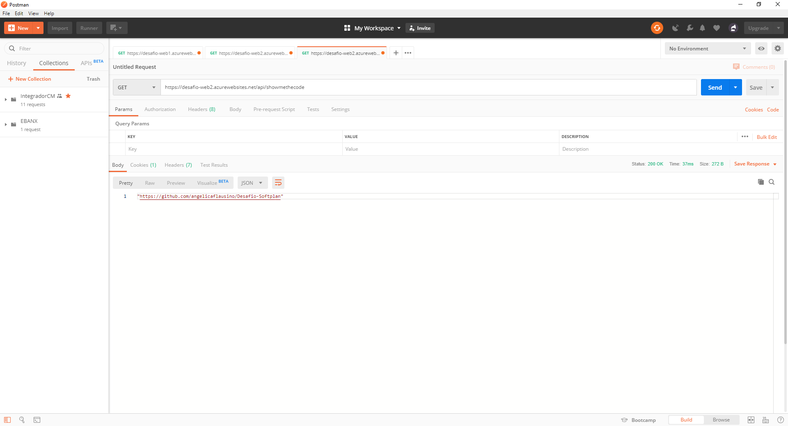

## Desafio Técnico Softplan

**Demanda**
Desenvolver uma solução em .Net Core que realize o cálculo de juros composto.

**Projeto**

A solução possui dois projetos Web.Api .Net Core, o primerio Web.Api1 é responsável por fornecer um endpoint que retorna uma taxa de juros base. O segundo projeto Web.Api2 é responsável calcular o juros composto.

**Instalação Local**

Sinta-se livre para baixar o projeto e testá-lo localmente. Para executar basta abrir o prompt de comando e navegar até a pasta da solução. Execute os seguintes comandos para as duas APIs.

**Web.Api1**

    cd Web.Api1
    dotnet run

**Web.Api2**

    cd Web.Api2
    dotnet run

Por padrão o console irá exibir para a primeira API a porta "localhost:5001" e para a segunda "localhost:5002". Você poderá alterar as portas dos respectivos projetos em **Program.cs**

    public class Program
    {
        public static void Main(string[] args)
        {
            CreateWebHostBuilder(args).Build().Run();
        }

        public static IWebHostBuilder CreateWebHostBuilder(string[] args) =>
            WebHost.CreateDefaultBuilder(args)
                .UseStartup<Startup>()
                .UseUrls("http://localhost:5001");
    }

> Lembre-se de alterar também no arquivo **appsettings.json** no projeto Web.Api2 e nas constantes dos Testes unitários e de integração.

## Docker 
As imagens das APIs estão disponíveis no DockerHub:

**Web.Api1**

    docker push alpha2office/webapi1:lastest

**Web.Api2**

    docker push alpha2office/webapi2:lastest

## Teste de Integração com Postman

**Obter taxa de juros**

**Calcular juros composto**

**Obter url do repositório**

## Teste com Swagger

**Demo do Projeto**
Teste as APIs online com Swagger.

[Web.Api1 (Taxa de Juros)](https://desafio-web1.azurewebsites.net)

[Web.Api2 (Calcular Juros)](https://desafio-web2.azurewebsites.net)
